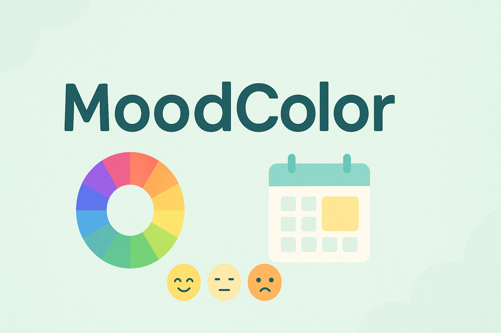

# 🎨 MoodColor

## Introduction
🎨 MoodColor is an AI-powered mood tracking tool that transforms your daily experiences—whether in text or photos—into a color that represents your current emotional state. Whether you're capturing joy, peace, or subtle melancholy, the system analyzes your input and assigns a HEX color code to visually express how you feel.

Users can maintain a daily mood journal through a calendar-like dashboard, upload content, and reflect on their emotional journey. The platform not only creates mood-based icons and themed pages but also supports collaboration—allowing friends or teams to co-create and share their emotional color stories.

This project aims to bring emotional awareness and a touch of healing by helping users visualize their feelings in color. Ideal for personal reflection, mood tracking, or simply expressing your day through design.

Built with modern technologies and supports extensibility via AI, containerized infrastructure, and modular event-driven architecture.

🎨 MoodColor 是一款由 AI 驅動的情緒追蹤工具，能將你的每日經歷——無論是文字或照片——轉化為代表當下情緒狀態的顏色。無論你感受到的是喜悅、平靜，還是細膩的憂鬱，系統都能分析你的輸入，並以 HEX 色碼的方式，視覺化地呈現你的感受。

使用者可透過類似行事曆的儀表板，維持每日情緒日記，並上傳內容、反思自己的情緒旅程。該平台不僅會根據情緒創建圖示與主題頁面，還支援多人協作，讓朋友或團隊一同共創、分享彼此的情感色彩故事。

本專案的目標是藉由「將情緒視覺化」來提升情感覺察力，帶來療癒的一點光。非常適合用於個人反思、情緒追蹤，或單純以設計方式表達你的一天。

採用現代化技術建構，支援 AI 擴充、容器化基礎架構與模組化事件驅動架構。

## Backend

這是專案的後端服務，使用 FastAPI 框架構建，並結合 Supabase 作為資料庫。

以下是如何設定和啟動後端服務的步驟。

### 1. 設定 .env 檔案

在`Backend`根目錄下，建立一個名為 `.env` 的檔案。此檔案將儲存你的 API 金鑰及其他機密設定。

#### 範例 `.env` 內容：
```env
SUPABASE_URL=<你的_supabase_url>
SUPABASE_KEY=<你的_supabase_key>
SUPABASE_KEY_AUTH=<你的_SUPABASE_KEY_AUTH>
GOOGLE_API_KEY=<你的_GOOGLE_API_KEY>
```

### 2. 安裝所需的 Python 套件
確保你已經安裝了 Python 和 pip，然後安裝專案所需的 Python 套件。使用以下指令安裝：
```
pip install -r requirements.txt
```

### 3. 啟動後端服務
安裝完套件後，使用 uvicorn 啟動 FastAPI 服務：
```
uvicorn main:app --reload
```
此指令將啟動後端服務並在本地伺服器上監聽變更。你可以透過瀏覽器或 Postman 等工具，訪問以下端點：
```
http://127.0.0.1:8000/docs
```
會顯示自動生成的 API 文件（Swagger UI）。

### 4. 結束
若要停止伺服器，請在終端機中按 
```
CTRL+C
```

感謝使用本專案，若有任何問題，請隨時聯絡團隊。


